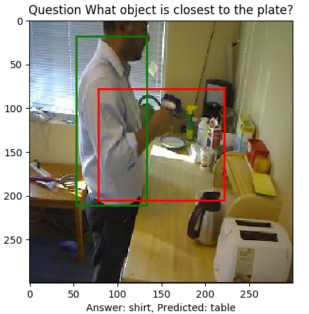
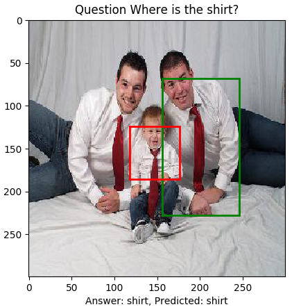
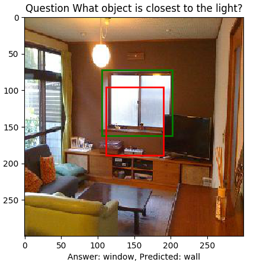

# Relational Localization

### Author

Jordan Ott and Josh Graves

### Relational Questions

[examples of rq's]

### Relation Networks

Relational reasoning is an essential component of intelligent systems. To this end, Relation Networks (RNs) are proposed to solve problems hinging on inherently relational concepts. To be more specific, RN is a composite function:

    ,

where *o* represents inidividual object while *f* and *g* are functions dealing with relational reasoning which are implemented as MLPs. Note that objects mentioned here are not necessary to be real objects; instead, they could consist of the background, particular physical objects, textures, conjunctions of physical objects, etc. In the implementation, objects are defined by convoluted features. The model architecture proposed to solve Visual Question Answering (VQA) problems is as follows.

    

(Santoro et. al, 2017)  

In addition to the RN model, **a baseline model** which consists of convolutional layers followed by MLPs is also provided in this implementation.  

## Sort-of-CLEVR Cube World  

To verify the effectiveness of RNs, a synthesized **VQA dataset** is proposed in the paper named Sort-of-CLEVR. The dataset consists of paired questions and answers as well as images containing colorful shapes.

Each **image** has a number of shapes (rectangle or circle) which have different colors (red, blue, green, yellow, cyan,  or magenta). Here are some examples of images.

    

**Questions** are separated into relational and non-relational questions which are encoded as binary strings to prevent the effect of language parsing and embedding; while **answers** are represented as one-hot vectors. Examples of images, questions and answers are as follow.

    

Given a queried color, all the possible questions are as follows.

**Non-relational questions**

* Is it a circle or a rectangle?
* Is it closer to the bottom of the image?
* Is it on the left of the image?

**Relational questions**

* The color of the nearest object?
* The color of the farthest object?

And the possible answer is a fixed length one-hot vector whose elements represent

*[red, blue, green, yellow, cyan, magenta, circle, rectangle, yes, no]*

### Intersection over Union (IoU)

#TODO

## Results

| | RN (Ans, Loc) | Baseline (Ans, Loc) | RN (Ans) | Baseline (Ans)
| --- | --- | --- | --- | --- |
| Non-relational question | 98.93% | 78.89% | **99.17%** | 77.87% |
| Relational question | **73.26%** | 42.82% | 71.82% | 45.71% |
| Overall Acc | **88.69%** | 64.43% | 88.19% | 65.03% |
| Non-relational IoU | **0.61** | 0.11 | ----------- | ----------- |
| Relational IoU | **0.17** | 0.09 | ----------- | ----------- |
| Overall IoU | **0.43** | 0.10 | ----------- | ----------- |

  |  
:-------------------------:|:-------------------------:
  |  
  |  
  |  

# Visual Genome Dataset

## Dataset

**Non-relational questions**

* Where is the *object*?
* Is the *object* on the left?

**Relational questions**

* What object is closest to the *object*?
* What object is farthest from the *object*?

Solarized dark             |  Solarized Ocean
:-------------------------:|:-------------------------:
  |  
## Results

| | RN (Ans, Loc) | Baseline (Ans, Loc) | RN (Ans) |
| --- | --- | --- | --- |
| Non-relational question | 90.63% | 40.65% | **90.64%** |
| Relational question | 20.44% | 0.00% | **20.48%** |
| Overall Acc | 60.86% | 23.41% | **60.88%** |
| Non-relational IoU | **0.10** | 0.09 | ----------- |
| Relational IoU | **0.09** | 0.08 | ----------- |
| Overall IoU | **0.10** | 0.09 | ----------- |

## Good Results  

  |  
:-------------------------:|:-------------------------:
  |  
  |  
  |

## Not so Good Results  

  |  
:-------------------------:|:-------------------------:
  |  
  |  
  |  

## Sources

* [A Simple Neural Network Module for Relational Reasoning](https://arxiv.org/abs/1706.01427)
* [Visual Interaction Networks](https://arxiv.org/abs/1706.01433) by Watters et. al.
* [Interaction networks for learning about objects, relations and physics](https://arxiv.org/abs/1612.00222) by Battaglia et. al.
* Shao-Hua Sun's [implementation](https://github.com/gitlimlab/Relation-Network-Tensorflow)

## Prerequisites

- Python 2.7 or Python 3.3+
- [Tensorflow 1.0.0](https://github.com/tensorflow/tensorflow/tree/r1.0)
- [NumPy](http://www.numpy.org/)
- [PIL](http://pillow.readthedocs.io/en/3.1.x/installation.html)
- [matplotlib](https://matplotlib.org/)
- [h5py](http://docs.h5py.org/en/latest/)
- [progressbar](http://progressbar-2.readthedocs.io/en/latest/index.html)
- [colorlog](https://github.com/borntyping/python-colorlog)

### To Do
- [x] Modify RN for localization
- [x] Create dataset from real images
  - [x] Relational questions
  - [x] Non-relational questions
  - [x] Bounding box coordinates (x,y,w,h)
  - [x] Visualize dataset examples
- [x] Experiments
  - [x] CNN without RN
    - [x] Non-relational questions
    - [x] Non-relational & relational questions
  - [x] CNN with RN
    - [x] Non-relational questions
    - [x] Non-relational & relational questions
  - [ ] Question embedding options
    - [ ] Preset one-hot questions (no RNN)
    - [ ] With RNN to process questions
- [x] Visualize bounding box results on images
